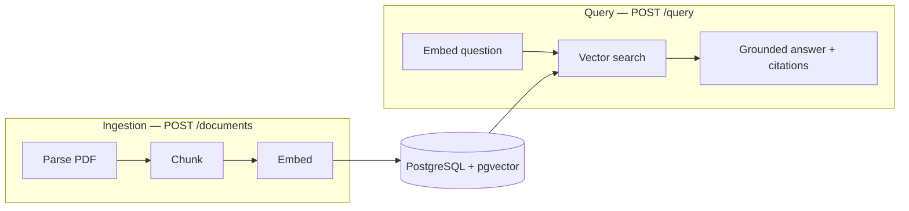

# arxiv-rag

**A retrieval-augmented question-answering service for arXiv papers.**

Ask a natural-language question across a collection of research papers and get an answer
grounded in the source text, with inline citations — so every claim is verifiable and
nothing is invented. Built as a backend/AI-engineering project with a clean, testable
architecture and reproducible local setup.


---

## Features

- **Grounded answers.** Responses are generated only from retrieved passages and cite
  their sources inline (`[1]`, `[2]`); if the answer isn't in the corpus, the service
  says so instead of hallucinating.
- **Semantic retrieval.** Papers are chunked, embedded, and searched by vector similarity
  using `pgvector` inside PostgreSQL.
- **Typed, self-documenting API.** FastAPI with automatic OpenAPI/Swagger docs at `/docs`.
- **Reproducible environment.** Postgres (with pgvector) and Redis run via Docker Compose;
  dependencies are locked with `uv`.
- **CI from day one.** Every push runs lint, type-checks, and tests against real
  Postgres+pgvector and Redis service containers.

---

## Architecture

The system is a pipeline with a deliberately clean seam: an **ingestion** path that turns
papers into searchable chunks, and a **query** path that turns a question into a grounded
answer. The two share only the datastore.



Each stage sits behind a small interface (`Embedder`, `Retriever`, `Generator`), so
implementations are swappable and independently testable. In this build the ingestion
path runs **synchronously**; moving it onto a background worker is the next milestone.

---

## Tech stack

| Area        | Choice                                                    |
|-------------|-----------------------------------------------------------|
| Language    | Python 3.10+                                              |
| API         | FastAPI + Uvicorn                                          |
| Storage     | PostgreSQL + pgvector (SQLAlchemy, psycopg 3)             |
| AI          | OpenAI embeddings (`text-embedding-3-small`) + chat model |
| PDF         | pypdf                                                      |
| Config      | pydantic-settings                                         |
| Tooling     | uv, ruff, mypy, pytest                                     |
| Local infra | Docker Compose (Postgres, Redis)                          |
| CI          | GitHub Actions                                             |

The embedder and generator sit behind interfaces, so the provider above is swappable.
Celery + Redis are wired in and used from the async-ingestion milestone onward.

---

## Getting started

### Prerequisites
- Python 3.10+
- [uv](https://docs.astral.sh/uv/)
- Docker + Docker Compose
- An OpenAI API key

### Setup
```bash
git cloned https://github.com/Duru-DR/arxiv-rag.git
cd arxiv-rag

uv sync                      # install dependencies
cp .env.example .env         # then add your OPENAI_API_KEY

docker compose up -d         # start Postgres + Redis
docker compose exec db psql -U rag -d rag -c "CREATE EXTENSION IF NOT EXISTS vector;"
uv run python -m app.core.init_db   # create tables
```

### Run
```bash
uv run uvicorn app.main:app --reload
# open http://localhost:8000/docs
```

---

## Usage

Ingest a paper:
```bash
curl -F "file=@paper.pdf" -F "title=Attention Is All You Need" \
     http://localhost:8000/documents
# -> {"document_id": "...", "n_chunks": 42}
```

Ask a question across the ingested papers:
```bash
curl -X POST http://localhost:8000/query \
     -H "Content-Type: application/json" \
     -d '{"question": "What problem does this paper solve?"}'
# -> {"answer": "... [1] ...", "sources": [ ... ]}
```

Or use the interactive Swagger UI at `http://localhost:8000/docs`.

---

## Project structure

```
app/
├── main.py            # FastAPI app
├── config.py          # settings
├── worker.py          # Celery app (used from the async milestone)
├── api/
│   └── routes.py      # endpoints
├── core/
│   ├── db.py          # engine / session
│   ├── models.py      # Document, Chunk
│   ├── interfaces.py  # the seams: Embedder, Retriever, Generator
│   └── init_db.py     # dev schema bootstrap
├── ingestion/         # parser, chunker, embedder
└── query/             # retriever, generator
tests/                 # unit + smoke tests
docker-compose.yml     # local Postgres + Redis
Dockerfile             # app image (CI / deploy)
```

---

## Testing

```bash
uv run pytest -q          # tests
uv run ruff check .       # lint
uv run ruff format --check .
uv run mypy app           # type-check
```

---

## Roadmap

- [x] **Walking skeleton** — end-to-end ingest → retrieve → grounded, cited answer
- [ ] **Async ingestion** — Celery worker, job tracking with live progress polling,
      retries on transient failure, idempotent uploads
- [ ] **Hybrid retrieval** — BM25 + vector search fused, with cross-encoder reranking
- [ ] **Precise citations** — answers cite the exact page/section of each source
- [ ] **Evaluation harness** — RAGAS-style retrieval/answer metrics enforced as a CI
      quality gate
- [ ] **Observability** — per-request cost, latency, and token metrics with a dashboard
- [ ] **Deployment** — containerized deploy with managed Postgres + Redis

---
